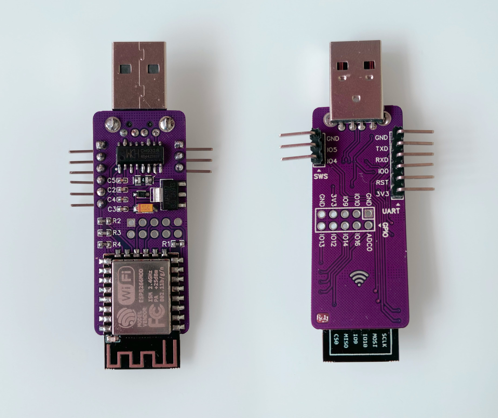
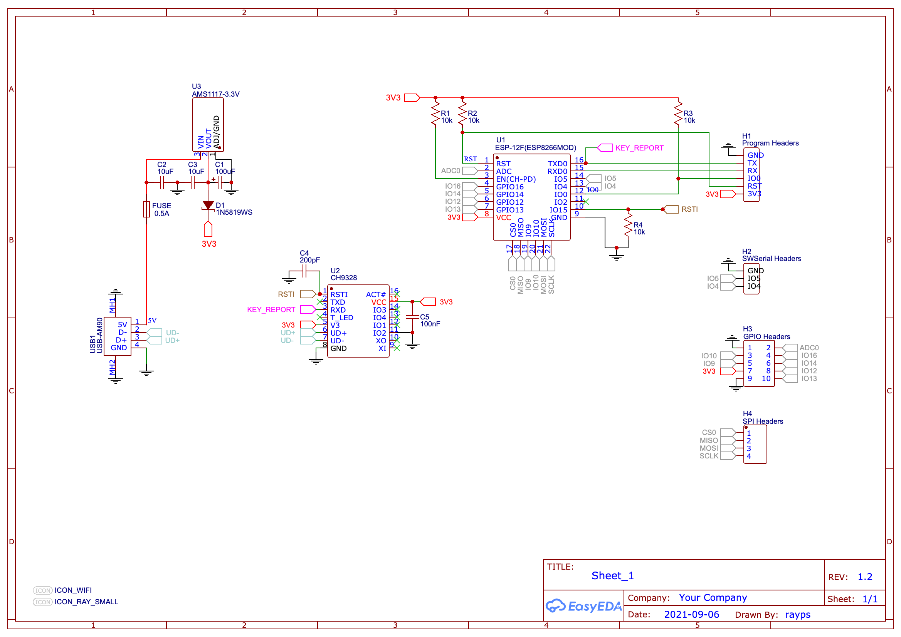
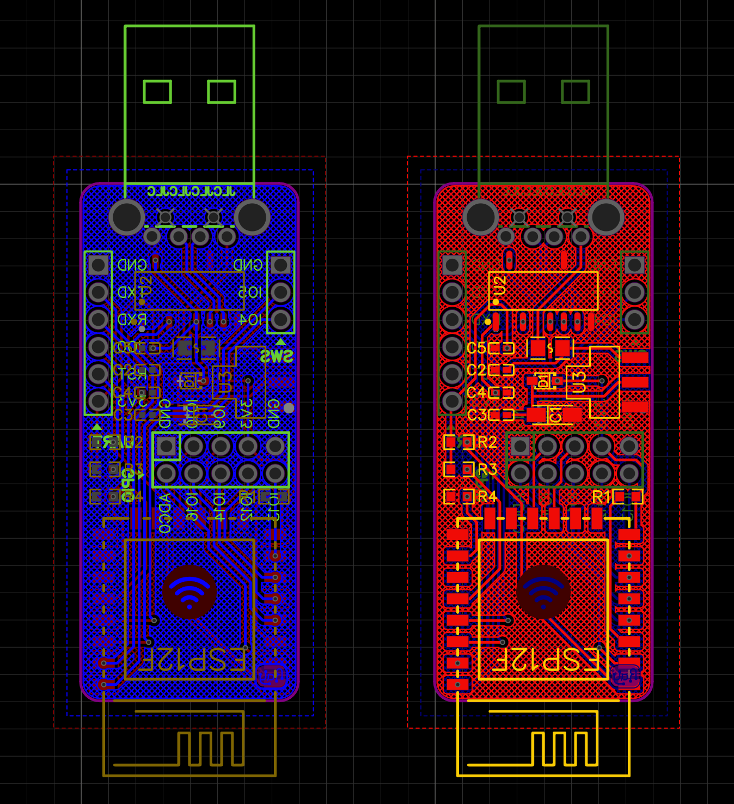

# WiFi-Keyboard
A remote control usb keyboard http server device based on ESP8266 & CH9328



## Schematics



## PCB




## Development
(An UART adapter with `DTR` & `RTS` port is required)
1. Open this project in PlatformIO
2. Connect the device to your computer using an UART adapter
3. Build and upload to the device

#### Connections
| UART Adapter | This Device |
| - | - |
| 3V3 | 3V3 |
| GND | GND |
| RX | TX |
| TX | RX |
| RTS | RST |
| DTR | IO0 |

## Usage
1. Plug the device to the host machine
2. Connect to the device WiFi named `Keyboard`, a config portal should appear
3. Choose to connect the same WiFi as your client machine network
4. Open [http://keyboard.local/](http://keyboard.local/) 

#### Use as HTTP API
```bash
curl -X "POST" "http://keyboard.local/" \
     -H 'Content-Type: application/json; charset=utf-8' \
     -d $'{"input": "HelloWorld"}'
```
or

`POST http://keyboard.local/?input=helloworld`


#### Notes
At the current stage of development, only printable characters are supported.

To support other keys I will need to make something like DuckyScript Parser.

But that's beyond the purpose of this project, the goal of this project is for game consoles such as Nintendo Switch/Playstation/Xbox etc.

## LED status
| LED | Status |
| - | - |
| Blinking | No network is connected |
| Light | Successfully connected to a network and MDNS is initialized |
| Dark after blink | Successfully connected to a network but MDNS failed |